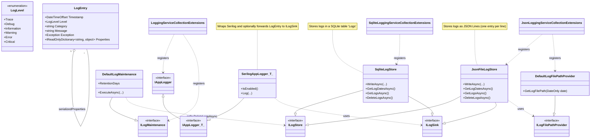

# Logging 模組類別與關係圖

以下為 Birdsoft.Infrastructure.Logging 中主要介面與實作類別的關係圖（Mermaid classDiagram）。

註：為避免 Markdown 將 `<T>` 當成 HTML，泛型使用 `_T_` 表示（例如 `IAppLogger_T_`）。

```mermaid
classDiagram

%% Enumerations / Models
class LogLevel {
  <<enumeration>>
  +Trace
  +Debug
  +Information
  +Warning
  +Error
  +Critical
}

class LogEntry {
  +DateTimeOffset Timestamp
  +LogLevel Level
  +string Category
  +string Message
  +Exception Exception
  +IReadOnlyDictionary~string, object~ Properties
}

%% Interfaces
class IAppLogger {
  <<interface>>
}
class IAppLogger_T_ {
  <<interface>>
}
class ILogSink {
  <<interface>>
}
class ILogStore {
  <<interface>>
}
class ILogMaintenance {
  <<interface>>
}
class ILogFilePathProvider {
  <<interface>>
}

%% Implementations
class SerilogAppLogger_T_ {
  +IsEnabled()
  +Log(...)
}
class DefaultLogMaintenance {
  +RetentionDays
  +ExecuteAsync(...)
}
class JsonFileLogStore {
  +WriteAsync(...)
  +GetLogDatesAsync()
  +GetLogsAsync()
  +DeleteLogsAsync()
}
class DefaultLogFilePathProvider {
  +GetLogFilePath(DateOnly date)
}
class SqliteLogStore {
  +WriteAsync(...)
  +GetLogDatesAsync()
  +GetLogsAsync()
  +DeleteLogsAsync()
}

%% DI / Extensions
class LoggingServiceCollectionExtensions
class JsonLoggingServiceCollectionExtensions
class SqliteLoggingServiceCollectionExtensions

%% Relationships
IAppLogger <|-- IAppLogger_T_
SerilogAppLogger_T_ --|> IAppLogger_T_
SerilogAppLogger_T_ ..> ILogSink : uses

JsonFileLogStore --|> ILogStore
JsonFileLogStore --|> ILogSink
JsonFileLogStore ..> ILogFilePathProvider : uses
DefaultLogFilePathProvider --|> ILogFilePathProvider

SqliteLogStore --|> ILogStore
SqliteLogStore --|> ILogSink

DefaultLogMaintenance --|> ILogMaintenance
DefaultLogMaintenance ..> ILogStore : calls DeleteLogsAsync

LoggingServiceCollectionExtensions ..> IAppLogger : registers
LoggingServiceCollectionExtensions ..> ILogMaintenance : registers
JsonLoggingServiceCollectionExtensions ..> JsonFileLogStore : registers
JsonLoggingServiceCollectionExtensions ..> DefaultLogFilePathProvider : registers
SqliteLoggingServiceCollectionExtensions ..> SqliteLogStore : registers

LogEntry "1" o-- "*" LogEntry : serializedProperties

%% Notes
note for SerilogAppLogger_T_ "Wraps Serilog and optionally forwards LogEntry to ILogSink"
note for JsonFileLogStore "Stores logs as JSON Lines (one entry per line)"
note for SqliteLogStore "Stores logs in a SQLite table 'Logs'"

```
